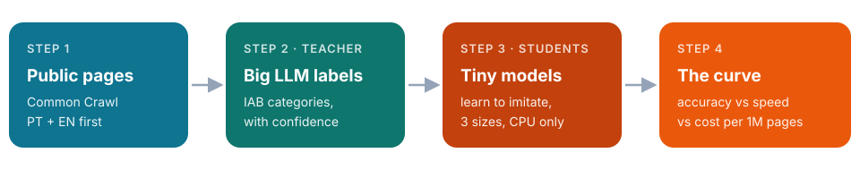

Hayate is a web-page categorizer. Give her a page, and she tells you what it's
about: **Sports › Running**, **Travel › Hotels**, **Technology & Computing**.
That's nothing new. The twist is the budget: **under a millisecond per page,
on a plain CPU, for almost no money.**

## The plan in one picture

A big LLM (the *teacher*) is accurate but slow and expensive. It labels a pile
of public web pages **once**. Then small models (the *students*) learn to copy
those labels. I'll try three sizes, from "count hashed word patterns" up to a
compact transformer. Then I'll plot how much accuracy each one loses for the
speed it gains.

## Why bother being that fast?

Ad platforms categorize pages ahead of time and cache the answer, so serving
it is just a lookup. At web scale, every millisecond is money. And a near-free
model can cover the pages the cache hasn't seen yet.

## Things I learned before writing a line of code

- **The teacher will be wrong a lot.** A 2025 study had ten LLMs label pages
  with the IAB taxonomy. They scored about **41% F1**, and they tagged pages
  with too many categories. So a human-checked sample isn't optional.
- **Fetching and extracting the page dwarfs the model.** Pulling the main text
  out of HTML takes about 30–100 ms. That's 100× my inference budget, so it gets
  measured separately.
- **The obvious tiny baseline is archived.** fastText has been read-only since
  2024, so tier 1 gets built on maintained tools.
- **The taxonomy file has no stable version.** IAB "3.1" was edited eight times
  after release, so I pin it by commit hash.

## Next weekend

Repo setup and pinning the taxonomy, then deciding how deep the labels go:
36 top-level categories, or about 360 with the second tier?
